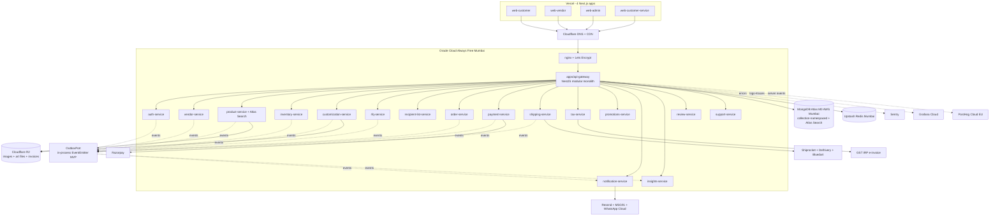

# LotusGift v2 — Architecture & Phase Plan

## 1. Recommendation (TL;DR)

**Yes, redo the architecture.** The current `apps/web` + `apps/api` stack is functional but single-vendor, single-warehouse, RFQ-only, and the redesigned UI is running against mocks (`apps/web/lib/api.ts`, `apps/web/lib/auth-client.ts`) — there is no production data to preserve. The nursery-plan architecture is a near-perfect fit for your stated needs, with three corporate-gifting-specific extensions:

- **AUTO-ROUTING** between instant Cart and RFQ (small orders → cart, large/customized → RFQ).
- **DEEP customization workflow** (art upload → mockup → approval → audit + in-app thread).
- **RECIPIENT-LIST drop-shipping** (CSV upload → N shipments to N recipients with per-recipient personalization).

The customer frontend's visual identity (brand-green, brand-pink, brand-ink palette + Plus Jakarta Sans + Geist + custom utilities like `btn-pink` / `eyebrow` / `h1-display`) is preserved 1:1 via `@repo/design-tokens` and re-implemented on Radix Primitives + CSS Modules + Sass (per nursery plan), in 4 separate Next.js apps deployed to Vercel.

Verified-current 2026 stack (latest docs, this session): NestJS 11 + nestjs-zod 5.3 + `@thallesp/nestjs-better-auth` 2.6 (Better-Auth ≥1.5) + Kubb 3 with `@kubb/plugin-react-query` + Mongoose 8 + Atlas M0 (3 search indexes / <2M docs / <10GB included) + Oracle Always Free A1.Flex 4 OCPU/24 GB ARM (7-day idle reclaim, heartbeat-mitigable).

## 2. Comparison summary

**Current LotusGift** ([apps/api/src/app.module.ts](apps/api/src/app.module.ts), [apps/web/app/layout.tsx](apps/web/app/layout.tsx), [docs/architecture.md](docs/architecture.md)):

- 2 apps (1 Next.js + 1 NestJS), 13 NestJS modules in one root, Mongoose + class-validator + Joi env, Tailwind v3 with custom palette, single-vendor, no warehouse, RFQ + Cart in parallel, mocks not wired to API ([apps/web/lib/api.ts](apps/web/lib/api.ts) returns mock data).

**Nursery plan** ([nursery-plan.md](nursery-plan.md), 509 lines): modular-monolith NestJS with `services/*` as Nest libraries mounted by `apps/api-gateway`, 4 Next.js apps, OutboxPort + transport-agnostic events, nestjs-zod + Kubb → `@repo/api` TanStack Query hooks, Atlas Search, Radix + CSS Modules + Sass, Oracle + Vercel, full observability (Sentry + Grafana + PostHog), 22 phases gated by research-note → epic → PRs.

**LotusGift v2** (this plan): nursery-plan architecture + 3 corporate-gifting services added (`rfq-service`, `customization-service`, `recipient-list-service`), corporate-gifting taxonomy on `product-service`, multi-recipient order model on `order-service`, drop Customer Prime, preserve `@thallesp/nestjs-better-auth` pattern (already used in current API), preserve visual design via tokens.

## 3. Target architecture

## 4. Key deltas from the nursery plan

**ADDED services (corporate-gifting specific):**

- `rfq-service` — Quote workflow + auto-router. `RouteDecisionPolicy(orderDraft) → 'cart' | 'rfq'` based on configurable thresholds (per-product MOQ, cart value, requires-customization flag). Carries: `Quote { quoteNumber, status: DRAFT|SENT|NEGOTIATING|ACCEPTED|REJECTED|EXPIRED, lineItems, negotiatedPricing, validUntil, attachments }`. Quote-to-PO conversion creates an `Order` via order-service. Replaces and extends the current [apps/api/src/quotes](apps/api/src/quotes) module.
- `customization-service` — Versioned art files in R2 (`art:<orgId>/<lineItemId>/v<n>.{ai,pdf,png}`), mockup-render workflow (vendor uploads mockup → buyer approves/rejects with notes), audit log of every state transition, in-app message thread scoped to a customization request. Used by `rfq-service` and `order-service`.
- `recipient-list-service` — CSV/Excel upload + Zod-validated parsing + per-recipient personalization payload (name on package, custom message, size variant, address, GSTIN if billed separately). One recipient-list-driven order produces N shipments via order-service's saga.

**MODIFIED services (vs nursery plan):**

- `product-service` — Corporate-gifting taxonomy in place of plant taxonomy: `occasion[]` (Diwali / Christmas / employee-anniversary / new-joiner / client-gifting / general), `recipientType[]` (employees / clients / partners), `customizable: boolean`, `brandingAreas[]` (front / back / sleeve / box / engraving / embroidery), `moq`, `leadTimeDays`, `sampleAvailable`, `hsnCode`. Vendor-scoped + per-warehouse stock joined at read time.
- `order-service` — Multi-recipient model. An `Order` aggregates N `Shipment`s, each with `(warehouseId, vendorId, recipientAddress, personalization, customizationRequestId?)`. Saga fans out per-shipment inventory + shipping-quote + tax-compute; payment authorised once for order total; per-shipment compensation on partial failure. Auto-routing call into `rfq-service.routeDraft()` at "Checkout" click — if it returns RFQ, the cart converts to a draft quote and the buyer is redirected to the RFQ thread.
- `auth-service` — Three Better-Auth `organization` plugin org types: `vendor-org` (with self-serve onboarding + admin approval gate before activation), `corporate-buyer-org` (NEW — corporate buyers with KYC + PO terms + credit limit + multi-stakeholder approval matrix), `internal-staff-org`. Individual retail buyers still allowed (no org).
- `promotions-service` — Drop Customer Prime. Keep vendor tiers + volume discounts + coupons + auto-replenish (used for recurring corporate gifting like monthly engagement gifts / quarterly client appreciation).
- `tax-service` — Default-on GST e-invoice for B2B (corporate-buyer-org GSTIN is always present after KYC). Per-shipment origin-state computed from fulfilling warehouse.
- `payment-service` — Add PO + credit-terms path for approved `corporate-buyer-org`s (Net-15 / Net-30 with credit limit enforcement). Razorpay still primary for non-credit orders.
- `shipping-service` — Per-warehouse pickup + per-recipient drop-off addresses (many destinations from one pickup), pickup-OTP per warehouse, RTO routing back to originating warehouse.

**REMOVED (vs nursery plan):**

- Customer Prime subscription (consumer plan, irrelevant for B2B corporate gifting).
- Plant taxonomy / pincode-fenced retail PLP / nursery-specific UX (compostable-pot filters, hardiness-zone search, etc.).
- Anonymous/guest checkout (corporate buyers MUST be authenticated + KYC'd for GST e-invoicing; retail still allowed if you want — parked decision).
- PWA offline-cart (corporate buyers use desktop, not mobile/offline).

## 5. Design system: preserve the look on the new stack

The visual identity moves into `packages/design-tokens` (TS source-of-truth, emits typed TS + SCSS variables + JSON for Figma sync) and `packages/ui` (Radix Primitives + CSS Modules + Sass, no Tailwind).

**Tokens captured from current [apps/web/tailwind.config.ts](apps/web/tailwind.config.ts) + [apps/web/app/layout.tsx](apps/web/app/layout.tsx):**

- Colors: `brand.green.{50..950}` (50=#E6F4ED, 500=#02783C, 900=#01331B), `brand.pink.{50..950}` (500=#F01282, 900=#4A052B), `brand.ink.{50..900}` (700=#2F2F38, 900=#0E0E13), stone scale (Tailwind defaults).
- Typography: Plus Jakarta Sans (sans + display, weights 400-800), Geist Sans + Geist Mono (local woff fallbacks via `next/font/local`).
- Radius: `4xl=2rem`, `5xl=2.5rem`, organic blob `40%_60%_55%_45%/55%_45%_55%_45%` (used in HeroSlider product hero).
- Shadow: `panel`, `pill`, `soft`, `elevated`, `elevated-lg`, `glow`, `glow-pink`.
- Animation keyframes: `fade-in-up`, `fade-in`, `slide-down`, `slide-up`, `slide-in-right`, `slide-in-left`, `scale-in`, `shimmer`, `float`, `spin-slow`, `pulse-soft`, `marquee`, `ken-burns`.
- Semantic utility classes (carried forward as Sass mixins): `btn-primary`, `btn-pink`, `btn-outline`, `btn-disc`, `btn-lg`, `eyebrow`, `h1-display`, `icon-circle`, `badge-soft`.

**`@repo/ui` re-implementation list (Radix-backed):**

- Primitives to port from current [apps/web/components/ui/](apps/web/components/ui): `Button`, `IconButton`, `Carousel` (keep Embla under the hood), `Tabs`, `Sheet` (Radix Dialog drawer), `Dialog`, `Tooltip`, `Accordion`, `Card`, `Pill`, `Badge`, `StarRating`, `QuantityStepper`, `Toaster` (keep Sonner), `Skeleton`, `SectionShell`, `Input`, `PriceTag`, `ImageWithFallback`.
- Composite blocks to port from [apps/web/components/home/](apps/web/components/home): `HeroSlider`, `TrustBar`, `CategoryMosaic`, `BestSellers`, `FeaturedCarousel`, `PromoBanners`, `HowItWorks`, `IndustryStrip`, `TestimonialsCarousel`.
- New for corporate gifting: `RecipientListUploader`, `ArtFileVersionViewer`, `MockupApprovalCard`, `CustomizationThread`, `QuoteCard`, `CampaignProjectCard`, `GstInvoicePanel`, `POTermsPanel`.

WCAG 2.2 AA floor + `@axe-core/playwright` in CI gates every page.

## 6. What we keep / extract / discard from current code

Move ALL current top-level files/dirs (except `.git`, `.cursor`, `.github`) into `_old/` via `git mv` to preserve history before re-scaffolding. The new tree built from scratch via CLI; the `_old/` folder lives at repo root permanently as a reference (it's in source control and visible to code-search, but excluded from the new monorepo's workspace via `pnpm-workspace.yaml` ignore pattern). Then:

**Extract into the new workspace** (cite-and-port, not lift-and-shift):

- Design system: [apps/web/tailwind.config.ts](apps/web/tailwind.config.ts) → `packages/design-tokens/src/`.
- UI components: [apps/web/components/](apps/web/components) → port to `packages/ui` on Radix + CSS Modules.
- Mock data + page wireframes: [apps/web/lib/mock-data.ts](apps/web/lib/mock-data.ts) → Design Discovery seeds for P16-P19 (the existing pages are the wireframes).
- Better-Auth setup pattern: [apps/api/src/auth.ts](apps/api/src/auth.ts) + [apps/api/src/main.ts](apps/api/src/main.ts) (Better-Auth mounted before body parsing, raw-body capture for Razorpay webhooks at `/api/payments/webhook`, `toNodeHandler` wiring) → re-applied in P4 `apps/api-gateway`.
- Razorpay webhook signature + verify pattern: [apps/api/src/payments/](apps/api/src/payments) → `services/payment-service`.
- `@thallesp/nestjs-better-auth` v2.6 integration approach already in [apps/api/package.json](apps/api/package.json) — confirmed still current; reuse the global AuthGuard + `@AllowAnonymous` + `@OptionalAuth` + `@Session` decorator pattern.
- ConfigModule + Joi env validation from [apps/api/src/app.module.ts](apps/api/src/app.module.ts) → upgrade to Zod via `packages/config` (nursery-plan style).

**Discard** (entirely re-written per nursery plan):

- All current Mongoose schemas (single-vendor, no warehouse — full redesign needed) at [apps/api/src/schemas/](apps/api/src/schemas).
- All controllers + DTOs (class-validator → Zod migration).
- 13-module flat root structure → `services/*` Nest libraries mounted by `apps/api-gateway`.
- All current docs except [docs/architecture.md](docs/architecture.md) (becomes ADR-001 reference) — full rewrite per nursery plan §7.
- [apps/web/lib/api.ts](apps/web/lib/api.ts) + [apps/web/lib/auth-client.ts](apps/web/lib/auth-client.ts) mocks → replaced by Kubb-emitted TanStack Query hooks in `@repo/api` + real Better-Auth client in `@repo/auth-client`.

## 7. Phased plan (22 phases)

P0 lays foundation. P1-P3b are leaf packages. P4 is the gateway shell. P5-P15 are services (one phase each, with corporate-gifting additions). P16-P19 are the 4 Next.js apps (Design Discovery first per page family). P20-P22 close out. Every phase: research-note → epic → PRs → tests → phase-acceptance, identical to nursery-plan workflow.

## 7b. Sub-plan + status-sync workflow (per todo)

User-requested workflow, codified here so every Phase-0..Phase-22 todo follows it:

1. **Draft sub-plan** for the todo via `CreatePlan` (creates a new `.cursor/plans/<todo-id>_*.plan.md` file). Sub-plan must include: research summary with retrieval-dated URLs, file-by-file deliverables, acceptance criteria, open questions, and the status-sync closing step (item 5 below).
2. **Deep research** — `WebFetch` / `WebSearch` the latest official docs (≤14 days) for every dependency touched by the todo. Bake citations into `docs/research/phase-<N>-<topic>.md`.
3. **User review** of the sub-plan. Refinements happen via direct edits to the sub-plan markdown.
4. **Execute** (switch to agent mode) — CLI-only for scaffolding (no hand-rolled `package.json` / `tsconfig` / etc. — only `create-turbo`, `create-next-app`, `nest g library`, `pnpm dlx tsx scripts/scaffold-package.ts`).
5. **Status sync** at the end of every sub-plan's implementation:
   - Update parent plan todo `status: pending → in_progress → completed` (frontmatter array).
   - Update the GitHub Projects v2 board item: Status field `Todo → In progress → In review → Done` via `gh project item-edit`.
   - Update the linked GitHub Issue: comment with PR link, then close with `state_reason: completed` via MCP `issue_write`.
   - If a research note exists, link the PR into it as the "Implementation Reference".
6. **Loop back to plan mode** for the next todo's sub-plan.

NO step in the loop is skipped. Every PR has a sub-plan + research note + status sync, even if the todo is small.

## 8. First-wave deliverables (Phase 0, 8 PRs — reordered: archive+scaffold FIRST)

- **PR-1 `chore(scaffold)`**: Move every top-level file/dir (except `.git`, `.cursor`, `.github`) into `_old/` (preserves git history via `git mv`). Re-scaffold the workspace via `pnpm dlx create-turbo@latest --example with-nestjs --package-manager pnpm` (run in a sibling temp dir then move contents in since `.git` blocks in-place). Rename `apps/web` to `apps/web-customer` then add 3 more Next.js apps via `pnpm dlx create-next-app@latest apps/web-vendor`, `apps/web-admin`, `apps/web-customer-service` (all with `--app --typescript --src-dir --import-alias "@/*" --no-tailwind --use-pnpm`). Generate empty Nest libraries via `nest g library <name>` for each of the 16 services. Create empty packages via `pnpm dlx tsx scripts/scaffold-package.ts <name>`. Add `gh` CLI install instructions to README. CLI captures latest stable versions automatically.
- **PR-2 `chore(rules)`**: Same rule set as nursery plan + LotusGift-specific rule `corporate-gifting-domain.mdc` (auto-routing thresholds, recipient-list validation, customization workflow invariants) + `no-composer-2.mdc` (user preference codified).
- **PR-3 `docs(architecture)`**: README + dep-graph + ADR-001..ADR-007 (extra ADR-007 explains corporate-gifting deltas: auto-routing, customization, recipient-list).
- **PR-4 `ci`**: Same CI surface as nursery plan + `corporate-gifting-domain.yml` linter that asserts: every order schema change updates the auto-router test matrix.
- **PR-5 `feat(infra)`**: `infrastructure/docker/docker-compose.yml` for local dev (Mongo + Redis + Mailhog + OTEL collector).
- **PR-6 `docs(design)+feat(design-tokens)`**: `docs/design/DESIGN.md` documents LotusGift palette + voice; `@repo/design-tokens` ports the brand palette + type + shadow + animation tokens listed in §5; `@repo/ui` baseline (Button + IconButton + Card + Pill + SectionShell + Toaster).
- **PR-7 `docs(runbook)+infra(oracle)`**: Oracle deploy runbook + nginx + Certbot + UFW + fail2ban + heartbeat-ping cron (every 6h, mitigates the 7-day idle-reclaim policy confirmed in 2026 docs).
- **PR-8 `docs(runbook)`**: `going-to-production.md` + `scaling-up.md` + `free-tier-burn.md` + `incident-response.md` + `backup-restore.md` + `oracle-quarterly-review.md`. All cite live free-tier quotas with retrieval date (Atlas M0: 3 search indexes / <2M docs / <10GB; Oracle: 4 OCPU+24 GB ARM; Upstash: 10k commands/day; Vercel Hobby; PostHog 1M events/mo).

Plus, alongside via GitHub MCP / Linear MCP (parked below): 23 milestones + label set + Phase-0 Research-Note + Epic + Phase-Acceptance issues. Pause before opening P1+ issues for your review.

## 9. Hosting + free-tier strategy

- **Backend**: Oracle Cloud Always Free Mumbai A1.Flex (4 OCPU + 24 GB RAM ARM, confirmed Apr 2026 docs). Single VM runs the `apps/api-gateway` Node process (modular monolith) + nginx + Certbot. Heartbeat-ping cron mitigates 7-day 95th-percentile-<20% idle reclaim.
- **Frontend**: Vercel Hobby for dev preview → Vercel Pro at P22 launch (commercial-use compliance). 4 separate Next.js projects each bound to a subdomain.
- **Data**: MongoDB Atlas M0 (AWS Mumbai) — collection-namespaced per service module to fit the "1 cluster per project" limit. Atlas Search budget: 3 indexes total — allocated to `products` (catalog search), `vendors` (vendor directory), and `orders` (admin/CS lookup). All other search via standard Mongo queries.
- **Cache + sessions + idempotency**: Upstash Redis (AWS Mumbai free tier).
- **Objects** (catalog images + customization art files + invoices): Cloudflare R2 (free egress).
- **Email / SMS / WhatsApp**: Resend + MSG91 + WhatsApp Cloud via MSG91.
- **Observability**: Sentry (errors + replay) + Grafana Cloud (logs/traces/metrics 14-day retention) + PostHog Cloud EU (product analytics + feature flags + session replay).
- **Payments**: Razorpay live for card/UPI/netbanking/wallets; PO + credit-terms path for approved corporate-buyer-orgs.
- **Source control + project management**: GitHub repo `goldr0g3r/lotusgift` (PUBLIC after Step-1 visibility flip per `docs/runbooks/github-setup.md` — unlocks free unlimited Actions minutes, branch protection, CODEOWNERS, Rulesets) + GitHub Issues + Milestones + Labels + Projects v2 (user-level board `LotusGift v2 Roadmap` with 4 custom fields: Phase / Workstream / Layer / Type).

70%-of-quota threshold opens an upgrade-path research-note via weekly cron (`scripts/free-tier-quota-burn.ts`).

## 9b. GitHub tooling strategy

- **GitHub MCP server** (`user-github`, already configured + PAT verified May 12 2026 as `goldr0g3r`) handles: `issue_write`, `pull_request_*`, `push_files`, `create_branch`, `create_or_update_file`, `delete_file`, `get_file_contents`, `search_*`, `list_*`, `request_copilot_review`, `assign_copilot_to_issue`, `merge_pull_request`.
- **`gh` CLI** (install via `winget install --id GitHub.cli` in agent mode at PR-2 scaffold) fills the MCP gaps: `gh label create`, `gh api repos/.../milestones`, `gh api repos/.../branches/main/protection`, `gh project create/edit/field-create` (Projects v2 GraphQL), `gh ruleset` (Rulesets).
- **Direct REST/GraphQL via `Invoke-RestMethod`** is a fallback only if neither MCP nor `gh` covers the call.
- **PAT scope requirements** documented in `docs/runbooks/github-setup.md`: classic needs `repo` + `workflow` + `project`; fine-grained needs Repo:`Administration/Contents/Issues/Pull-requests/Workflows/Discussions/Variables/Secrets/Webhooks/Actions` (R/W) + Repo:`Metadata` (R) + Account:`Projects` (R/W).

## 10. Open questions (parked for relevant phase research notes)

- **P5**: Corporate-buyer-org auth — separate Better-Auth org type with its own KYC flow, or a flag on individual customer accounts with org-like fields? Recommend separate org type for clean multi-stakeholder approval matrix.
- **P5**: Apple sign-in for individual retail buyers — MVP or post-launch?
- **P7/P8b**: Customization workflow — vendor uploads mockup manually, vs system integrates with a design tool API (e.g., Figma file generation, Canva connect) for auto-mockup? Recommend manual MVP, automation in scaling-up.md.
- **P8b**: Art file format whitelist — `.ai` + `.pdf` + `.png` only, or include `.psd` / `.cdr`? Affects R2 storage + virus-scan integration.
- **P9**: Auto-routing thresholds — per-product MOQ, cart value, or both? Configurable per vendor in vendor-service settings, or platform-global? Recommend per-vendor with platform defaults.
- **P9c**: Recipient-list CSV schema — fixed columns or vendor-configurable? Per-recipient variant selection allowed or only one variant per order? Recommend fixed schema with optional variant column for MVP.
- **P10**: PO + credit-terms — credit limit underwriting workflow (admin sets per corporate-buyer-org), and what happens at limit breach (block new orders / require deposit / escalate)?
- **P13**: GST e-invoice — mandatory for all B2B in MVP, or threshold-gated per current IRP rules? Verified in P13 research note.
- **P14**: Vendor tier proration on upgrade/downgrade — daily or monthly?
- **P16**: 4-app SSO via Better-Auth — single cookie domain (`.lotusgift.com`) covering all 4 subdomains? Test cross-subdomain session in P5 research note.
- **Tooling**: GitHub Issues (nursery-plan default) vs Linear (MCP enabled in this workspace) for epics/issues — pick one before P0 GitHub-MCP step.
- **Scaling**: Trigger thresholds for `auth` / `payment` / `order` microservice split — GMV-based vs CPU-based.
