# LotusGift v2

Multi-vendor multi-warehouse corporate-gifting marketplace for India. Built as a Turborepo monorepo with a NestJS modular monolith (`apps/api-gateway` mounting 16 service libraries) and 4 Next.js apps (customer, vendor, admin, customer-service) — all deployed to Oracle Cloud Mumbai + Vercel.

**Status: Phase 0 (foundation) in progress.** PR-1 landed the scaffolded workspace; PR-2 landed governance (rules + agents + skills); PR-3 landed architecture docs (ADRs + dep-graph + README rewrite); PR-5 landed the local Docker dev stack; **PR-4 (this PR) lands the CI surface** — 10 GitHub Actions workflows + Renovate + dep-cruiser + branch protection (applied post-merge). Implementation continues across PR-6 through PR-22 per the [parent architecture plan](.cursor/plans/lotusgift_v2_architecture_rebuild_512d4adf.plan.md) and tracked on the [GitHub Projects v2 board](https://github.com/users/goldr0g3r/projects/9).

## Vision

LotusGift is an India-launched B2B marketplace for corporate gifting. Buyers — HR teams, founders, client-relations managers — discover gift catalogs from multiple vendors, customize them with their company logo or a personal message, and ship them either as one parcel or as N parcels to N recipients from a CSV. Vendors run their own catalogs, warehouses, and SLAs; the platform handles auto-routing between instant cart and quote workflows, payments via Razorpay (UPI / cards / netbanking / wallets / COD / PO + credit terms), shipping via Shiprocket-aggregated carriers + Delhivery + Bluedart, and GST-compliant per-shipment e-invoicing through the IRP.

Three corporate-gifting motions distinguish LotusGift from the underlying nursery-plan template:

- **Auto-routing** between instant cart and RFQ — small orders go through cart, large/bulk/customised orders route into a quote-and-PO motion ([ADR-007](docs/adr/0007-corporate-gifting-deltas-rfq-customization-recipient-list.md)).
- **Deep customization workflow** — versioned art uploads to R2, vendor-produced mockups, audited approval state machine, in-app threading.
- **Recipient-list drop-shipping** — buyer uploads a CSV of recipients and gets one Order containing N Shipments with per-recipient personalisation.

## Architecture at a glance



- **Frontend:** 4 Next.js apps on Vercel (Hobby pre-launch → Pro at P22 for commercial-use compliance). Cloudflare DNS + CDN + WAF in front.
- **Backend:** NestJS modular monolith `apps/api-gateway` on a single Oracle Cloud A1.Flex VM in Mumbai (4 OCPU + 24 GB RAM ARM, Always Free), mounting 16 service libraries from `services/*`. Single deploy target, single observability pipeline.
- **Event bus:** transport-agnostic `OutboxPort` (`@repo/utils`); in-process `EventEmitter` for MVP, replaceable later without touching producers or consumers.
- **Data:** MongoDB Atlas M0 (AWS Mumbai) with collection-namespacing per service module; Atlas Search budget allocated to `products`, `vendors`, `orders` (3 / 3 indexes used, [ADR-006](docs/adr/0006-atlas-search-m0-budget-3-indexes.md)). Upstash Redis for cache + rate-limiting + idempotency. Cloudflare R2 for catalog images, customization art files, and invoice PDFs.
- **External:** Razorpay payments + webhook, Shiprocket / Delhivery / Bluedart shipping, GST IRP e-invoice, Resend + MSG91 + WhatsApp Cloud messaging.
- **Observability:** Sentry (errors) + Grafana Cloud (logs / traces / metrics) + PostHog Cloud EU (RUM + product analytics + feature flags + session replay).

See [`docs/architecture/`](docs/architecture/) for the rendered dep-graph and the canonical index.

## Decision log

Architecturally-significant decisions live as MADR records in [`docs/adr/`](docs/adr/). Read these first if you're new:

| ADR | Decision |
|-----|----------|
| [0001](docs/adr/0001-india-launch-razorpay-and-carrier-aggregator.md) | India-only launch on Razorpay with Shiprocket + Delhivery + Bluedart aggregator pool. |
| [0002](docs/adr/0002-rest-over-trpc-with-nestjs-zod-and-kubb.md) | REST + nestjs-zod + Kubb-generated TanStack Query hooks; tRPC and GraphQL rejected. |
| [0003](docs/adr/0003-vendor-tiered-monetization-no-customer-prime.md) | Vendor tier subscriptions + sliding commission + volume discounts + B2B auto-replenish; no consumer Prime. |
| [0004](docs/adr/0004-modular-monolith-first.md) | Modular monolith hosting 16 service libraries; transport-agnostic OutboxPort enables clean later extraction. |
| [0005](docs/adr/0005-hosting-oracle-mumbai-plus-vercel.md) | Backend on Oracle Cloud A1.Flex Mumbai; frontend on Vercel; Cloudflare DNS + CDN. |
| [0006](docs/adr/0006-atlas-search-m0-budget-3-indexes.md) | MongoDB Atlas Search M0 — 3-index budget on `products`, `vendors`, `orders`. |
| [0007](docs/adr/0007-corporate-gifting-deltas-rfq-customization-recipient-list.md) | Three new services (`rfq-service`, `customization-service`, `recipient-list-service`) plus four modifications for corporate-gifting. |

## Workspace layout

```text
lotusgift/
├── _old/                         # archived previous codebase (single-vendor RFQ site); reference only
├── apps/
│   ├── api-gateway/              # NestJS modular monolith host (port 3001)
│   ├── web-customer/             # Next.js retail + corporate buyer surface (port 3000)
│   ├── web-vendor/               # Next.js vendor portal (port 3002)
│   ├── web-admin/                # Next.js internal admin (port 3003)
│   └── web-customer-service/     # Next.js customer-service console (port 3004)
├── services/                     # 16 NestJS service libraries (pnpm workspace packages, prefix `@lotusgift/*`)
│   ├── auth-service/             # Better-Auth + organization plugin (vendor-org / corporate-buyer-org / internal-staff-org)
│   ├── vendor-service/           # onboarding + multi-warehouse registry + SLA scoring
│   ├── product-service/          # catalog + corporate-gifting taxonomy + Atlas Search sync
│   ├── inventory-service/        # per-(variant, warehouse) stock + Redis reservations
│   ├── customization-service/    # versioned art uploads + mockup approval + in-app thread
│   ├── rfq-service/              # quote workflow + auto-router (cart vs RFQ)
│   ├── recipient-list-service/   # CSV recipient upload + per-recipient personalization
│   ├── order-service/            # multi-recipient orders + saga orchestrator
│   ├── payment-service/          # Razorpay + PO + credit terms
│   ├── shipping-service/         # Shiprocket + Delhivery + Bluedart adapters
│   ├── tax-service/              # GST per-shipment + IRP e-invoice
│   ├── promotions-service/       # vendor tiers + volume discounts + auto-replenish
│   ├── notification-service/     # Resend + MSG91 + WhatsApp + in-app
│   ├── insights-service/         # vendor AI forecasting
│   ├── review-service/           # reviews + sentiment
│   └── support-service/          # tickets + RMA
├── packages/                     # 18 shared workspace packages (prefix `@repo/*`)
│   ├── api/                      # Kubb-generated TanStack Query hooks (P4)
│   ├── analytics-sdk/            # PostHog wrapper
│   ├── auth-client/              # Better-Auth client
│   ├── config/                   # env Zod schema
│   ├── database/                 # Mongoose helper
│   ├── design-tokens/            # TS source-of-truth, emits typed TS + SCSS
│   ├── eslint-config/            # shared ESLint flat configs
│   ├── events/                   # transport-agnostic event schemas
│   ├── feature-flags/            # PostHog flags
│   ├── jest-config/              # shared Jest configs
│   ├── observability/            # OTEL + RUM SDK init
│   ├── openapi-spec/             # shared OpenAPI x-* extensions
│   ├── prettier-config/          # shared Prettier config
│   ├── types/                    # shared TS types
│   ├── typescript-config/        # shared tsconfig bases
│   ├── ui/                       # Radix + CSS Modules + Sass + Lucide (PR-6)
│   ├── utils/                    # OutboxPort + redactor + ulid + pino + retry
│   └── validators/               # Zod schemas (source of truth)
├── scripts/
│   └── scaffold-package.ts       # tsx CLI: `pnpm dlx tsx scripts/scaffold-package.ts <package|service> <name>`
├── docs/
│   ├── adr/                      # MADR 4.0 architecture decision records
│   ├── architecture/             # dep-graph (Mermaid + SVG) + architecture index
│   ├── runbooks/                 # operational runbooks (Oracle deploy, going-to-production, etc. — PR-7 / PR-8)
│   └── research/                 # phase-N-topic research notes with retrieval-dated citations
└── .cursor/plans/                # multi-PR plans for the rebuild
```

## Quickstart

Requires: Node 22+ (active LTS), pnpm 9+, `gh` CLI (for PR creation), Git.

```powershell
# 1. Clone + cd
git clone https://github.com/goldr0g3r/lotusgift.git
cd lotusgift

# 2. Install all workspace deps
pnpm install

# 3. Build everything
pnpm build

# 4. Lint
pnpm lint

# 5. Run dev (all apps in parallel via turbo)
pnpm dev
```

Ports during dev: api-gateway `:3001`, web-customer `:3000`, web-vendor `:3002`, web-admin `:3003`, web-customer-service `:3004`.

## Local development

LotusGift v2 supports two local-dev paths for MongoDB + Redis:

1. **Host install** (team default) — `apt`/`brew`/`winget`-installed Mongo + Redis listening on `localhost:27017` + `localhost:6379`. Lowest friction, lowest RAM idle cost, matches what most contributors already have. Walkthrough at [`docs/runbooks/local-development.md`](docs/runbooks/local-development.md).
2. **Docker compose fallback** — the [`infrastructure/docker/docker-compose.yml`](infrastructure/docker/docker-compose.yml) stack from PR-5 spins up Mongo + Redis + Mailpit + OTEL Collector in containers. Use this for: corporate-locked workstations, clean-room reproduction, contributors who need Mailpit (P12) or the OTEL Collector (P21) locally, or anyone who prefers Docker. Reference at [`infrastructure/docker/README.md`](infrastructure/docker/README.md).

Both paths bind on the same default ports, so all `.env.development` files use `mongodb://localhost:27017/lotusgift` + `redis://localhost:6379` regardless of which path you picked.

The complete operational runbook index lives at [`docs/runbooks/README.md`](docs/runbooks/README.md).

## Phase roadmap

Twenty-two phases, P0 → P22, each gated by research-note → epic → PRs → tests → phase-acceptance:

- **P0 — Foundation:** scaffold (PR-1, done), rules + governance (PR-2, done), docs + ADRs (PR-3, done), **CI (PR-4, this PR)**, dev stack (PR-5, done), design tokens + base UI (PR-6), Oracle runbook (PR-7), future-state runbooks (PR-8).
- **P1–P3b — Leaf packages:** `@repo/typescript-config` / `eslint-config` / `jest-config` / `prettier-config` / `types` / `validators` / `events` / `openapi-spec` / `database` / `config` / `utils` / `observability` / `analytics-sdk` / `feature-flags`.
- **P4 — API gateway shell:** trace-id middleware, rate-limit, helmet, CSP, Better-Auth mount, RFC 9457 error envelope, Kubb codegen wired in CI.
- **P5–P15 — Services:** auth → vendor → product → inventory → customization → rfq → recipient-list → order → payment → shipping → tax → promotions → notification → insights.
- **P16–P19 — Four Next.js apps:** web-customer → web-vendor → web-admin → web-customer-service. Design Discovery first, per page family.
- **P20–P22 — Review + observability + launch:** `review-service` + `support-service`, Grafana dashboards + alert rules, then commercial launch (Vercel Pro upgrade, Razorpay live, Shiprocket / Delhivery / Bluedart live, OWASP ASVS L2 self-audit, SBOM, DR drill).

Full phase plan: [`.cursor/plans/lotusgift_v2_architecture_rebuild_512d4adf.plan.md`](.cursor/plans/lotusgift_v2_architecture_rebuild_512d4adf.plan.md). Per-todo sub-plans live alongside as `.cursor/plans/<todo-id>_sub-plan_*.plan.md`.

## Free-tier posture

LotusGift runs entirely on free tiers until P22:

- **Backend:** Oracle Cloud Always Free A1.Flex Mumbai (4 OCPU + 24 GB RAM ARM, [ADR-005](docs/adr/0005-hosting-oracle-mumbai-plus-vercel.md)). Heartbeat cron every 6 h mitigates the 7-day idle-reclaim policy.
- **Frontend:** Vercel Hobby for pre-launch (non-commercial); upgrades to Pro on P22 launch.
- **Data:** MongoDB Atlas M0 (3 search indexes max; budget allocated in [ADR-006](docs/adr/0006-atlas-search-m0-budget-3-indexes.md)), Upstash Redis free tier, Cloudflare R2 (free egress).
- **External:** PostHog Cloud EU free tier (1 M events/month), Sentry free tier, Grafana Cloud free tier, Resend free tier, MSG91 pay-as-you-go.

Detailed quotas, 70 %-threshold burn alerts, and M0 → M10 / Hobby → Pro upgrade triggers ship with [`docs/runbooks/free-tier-burn.md`](docs/runbooks/free-tier-burn.md) (PR-8).

## Contributing

This repo runs persistent guidance for both human contributors and AI coding agents:

- **Cursor rules** — [`.cursor/rules/*.mdc`](.cursor/rules/) — concise, enforceable. Loaded automatically by Cursor agents and human reviewers.
- **GitHub Copilot instructions** — [`.github/copilot-instructions.md`](.github/copilot-instructions.md) + [`.github/instructions/`](.github/instructions/) — repo-wide and path-scoped Copilot guidance, mirroring the Cursor rules.
- **`AGENTS.md`** + **`CLAUDE.md`** — agent-format pointer files for Cursor / Claude Code / Codex.
- **Skills + subagents** — [`.cursor/skills/`](.cursor/skills/) (procedure libraries) and [`.cursor/agents/`](.cursor/agents/) (specialised reviewers).

Every PR follows the workflow in [parent plan §7b](.cursor/plans/lotusgift_v2_architecture_rebuild_512d4adf.plan.md): sub-plan → research note → execution → status sync (parent plan todo + Projects v2 board + linked issue).

## Continuous integration

PR-4 wired the Phase-0 CI surface. Every PR to `main` runs these checks (see [docs/research/phase-0-ci.md](docs/research/phase-0-ci.md) and [infrastructure/github/README.md](infrastructure/github/README.md)):

| Workflow | Trigger | Purpose |
| --- | --- | --- |
| [`ci.yml`](.github/workflows/ci.yml) | PR + push to `main` | `typecheck` + `lint` + `test` + `build` + `markdownlint` + `actionlint` over the monorepo (Node 22.x, pnpm 9). |
| [`pr-title.yml`](.github/workflows/pr-title.yml) | PR opened/edited | Enforces `<type>(<scope>): <subject>` per [`.cursor/rules/commit-conventions.mdc`](.cursor/rules/commit-conventions.mdc). |
| [`secret-scan.yml`](.github/workflows/secret-scan.yml) | PR + weekly cron | TruffleHog `--only-verified --fail` on full diff. |
| [`dependency-review.yml`](.github/workflows/dependency-review.yml) | PR | `fail-on-severity: high` + license allow-list. |
| [`dep-cruiser.yml`](.github/workflows/dep-cruiser.yml) | PR + push to `main` | L0→L6 architecture-layers + microservice-boundaries enforcement (see [`.dependency-cruiser.cjs`](.dependency-cruiser.cjs)). |
| [`openapi-drift.yml`](.github/workflows/openapi-drift.yml) | PR + push to `main` | Skeleton — fires once `packages/api/openapi.json` exists (P4). |
| [`atlas-search-mapping-drift.yml`](.github/workflows/atlas-search-mapping-drift.yml) | PR + push to `main` | Skeleton — enforces M0 3-index budget once `infrastructure/atlas/search/*.json` lands (P7). |
| [`corporate-gifting-domain.yml`](.github/workflows/corporate-gifting-domain.yml) | PR + push to `main` | Asserts auto-router matrix is updated when order/rfq/recipient-list/customization service code changes (P9 onward). |
| [`free-tier-burn.yml`](.github/workflows/free-tier-burn.yml) | Mon 00:00 UTC cron | Atlas + Vercel + PostHog + Upstash + Oracle quota check; opens an issue if any > 70 % (see [`scripts/free-tier-quota-burn.ts`](scripts/free-tier-quota-burn.ts)). |
| [`release.yml`](.github/workflows/release.yml) | Tag `v*` push | Draft GitHub Release with auto-generated notes; manual publish. |

Renovate runs Monday 06:00 Asia/Kolkata via [`renovate.json`](renovate.json) (groups non-major updates, auto-merges patches, escalates security alerts). Branch protection on `main` is applied post-merge of PR-4 via [`infrastructure/github/branch-protection.json`](infrastructure/github/branch-protection.json).

## License

UNLICENSED (private).
