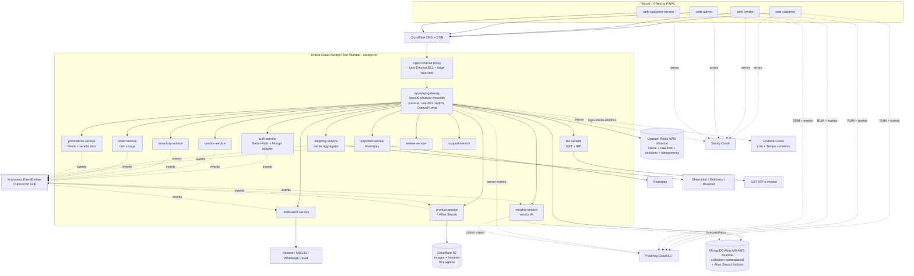
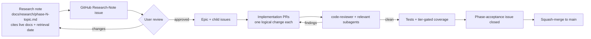
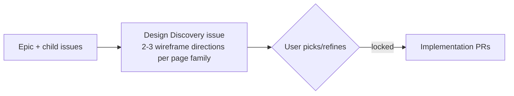

# Nursery Marketplace — Architecture & Phase Plan

## 1. What we're building

India-launch multi-vendor nursery & gardening marketplace. Sells plants, gardening tools, fertilizers, pots. Two audiences plus internal staff:

- **Customers** (retail + bulk, unified) — browse, search, subscribe (Prime-like), buy. Bulk buying is just a quantity change at PDP/cart; if the customer is a business they can attach a GSTIN at checkout to receive a GST e-invoice. Vendor-defined volume-discount tiers (e.g., 10+ units = 5% off) apply automatically. Delivery ETA and shipping cost are computed per item from the **nearest fulfilling warehouse** to the customer's pincode; an order can split into multiple shipments when items originate from different vendor warehouses. No separate B2B portal, no RFQ flow, no credit terms.
- **Vendors** (the B2B side of the marketplace) — list catalog, **manage multiple warehouses** (each with its own geocoded address + state + city + pincode + lat/lng + operating hours + pickup SLA + carrier cut-off times + service-zone polygon-or-pincode-list + enable/disable toggle; per-warehouse stock split owned by inventory-service; carrier pickup origin, delivery ETA, shipping rate, and GST origin-state are all derived from the **fulfilling warehouse** record), fulfill orders, see AI-driven demand insights, pay tiered subscription + sliding commission. Vendors are organisations (Better-Auth `vendor-org` with owner / staff / warehouse-manager / inventory-manager roles; **warehouse-manager and inventory-manager memberships are scoped to specific warehouses via vendor-org teams — one team per warehouse, with `team-id == warehouseId`** — so a warehouse-manager only sees orders, stock, and pickup OTPs for the warehouse(s) they're assigned to).
- **Internal staff** — admin, support, finance, content — in their own `internal-staff-org`.

## 2. Architecture



## 3. Stack

No version pins in the plan — CLI captures the latest stable at scaffold time. Each phase's research note `WebFetch`es official docs of every dependency it introduces, captures page title + retrieval date (≤14 days old), and pins exact versions in the note. This is codified in `.cursor/rules/always-latest-docs.mdc`.

**Languages + Runtime**: TypeScript on Node.js LTS, ARM64 in production (Oracle Ampere).

**Monorepo + tooling**: Turborepo + pnpm workspaces. ESLint (flat config). Prettier. Jest (backend). Vitest (frontend). Playwright + `@axe-core/playwright` (E2E + a11y).

**Backend**: NestJS (modular monolith). `@nestjs/swagger` + `nestjs-zod` for OpenAPI 3.1 emit. Kubb consumes the spec → typed TanStack Query hooks in `@repo/api`. Mongoose for MongoDB. ioredis + `@upstash/redis` for cache. `@nestjs/event-emitter` for in-process events (Outbox transport-agnostic interface, swappable later).

**Frontend**: Next.js App Router. React. **Radix UI Primitives** (per-primitive packages, tree-shaken) + **CSS Modules + Sass + CSS variables for design tokens** + **Lucide** icons. NO Tailwind, NO shadcn. TanStack Query for server state. Custom Nursery palette.

**Auth**: Better-Auth + `@better-auth/mongo-adapter`. Plugins: organization, twoFactor, passkey, phoneNumber, anonymous, admin. Mounted in `services/auth-service`, served at `/api/auth/*` by the gateway.

**Data**: MongoDB Atlas (M0 free, AWS Mumbai, collection-namespaced per service module) + Atlas Search built-in. Upstash Redis (AWS Mumbai, free tier). Cloudflare R2 for objects (free egress). PostHog Cloud EU for analytics + feature flags + session replay.

**Integrations**: Razorpay (payments + subscriptions), Shiprocket / Delhivery / Bluedart (shipping), GST IRP (e-invoice), Resend (email), MSG91 (SMS + WhatsApp Cloud), Sentry (errors), Grafana Cloud (logs + metrics + traces).

**Hosting**: Vercel Hobby (dev preview) → Vercel Pro (production launch) for the 4 Next.js apps. Oracle Cloud Always Free Mumbai (4 ARM cores, 24 GB RAM, always-on, ~10 ms India latency) for the NestJS monolith, fronted by nginx + Cloudflare DNS+CDN.

**CI**: GitHub Actions (2000 min/mo free on private repo). GHCR for Docker images.

## 4. Workspace layout

```text
nursery-ecommerce/
├── apps/
│   ├── api-gateway/                  # NestJS modular-monolith host
│   ├── web-customer/                 # Next.js PWA
│   ├── web-vendor/                   # Next.js PWA
│   ├── web-admin/                    # Next.js PWA
│   └── web-customer-service/         # Next.js PWA
├── services/                         # NestJS libraries (nest g library), mounted by gateway
│   ├── auth-service/                 # Better-Auth + plugins
│   ├── vendor-service/
│   ├── product-service/              # + Atlas Search index sync
│   ├── inventory-service/
│   ├── order-service/
│   ├── payment-service/
│   ├── shipping-service/
│   ├── tax-service/
│   ├── promotions-service/           # Prime + vendor tiers + coupons + auto-replenish
│   ├── notification-service/
│   ├── insights-service/             # vendor AI
│   ├── review-service/
│   └── support-service/
├── packages/
│   ├── typescript-config/
│   ├── eslint-config/                # flat config
│   ├── jest-config/
│   ├── prettier-config/
│   ├── types/
│   ├── validators/                   # Zod schemas — single source of truth
│   ├── events/                       # transport-agnostic event schemas + __schemaVersion
│   ├── openapi-spec/                 # shared x-* extensions + error envelopes
│   ├── database/                     # Mongoose + collection-namespace helper
│   ├── config/                       # env Zod schema
│   ├── utils/                        # OutboxPort + redact + ulid + retry + pino mixin
│   ├── observability/                # OTEL + RUM SDK init
│   ├── analytics-sdk/                # PostHog browser + server wrapper
│   ├── feature-flags/                # PostHog flags wrapper
│   ├── auth-client/                  # Better-Auth client + session helpers
│   ├── api/                          # Kubb-generated TS + TanStack Query hooks
│   ├── design-tokens/                # TS → SCSS + typed TS
│   └── ui/                           # Radix + CSS Modules + Sass + Lucide
├── infrastructure/
│   ├── docker/                       # local-dev docker-compose
│   └── oracle/                       # prod docker-compose + nginx + certbot + systemd
├── scripts/
│   ├── scaffold-package.ts
│   ├── verify-openapi-drift.ts
│   ├── verify-atlas-search-mapping-drift.ts
│   ├── free-tier-quota-burn.ts
│   └── generate-dep-graph.ts
├── docs/
│   ├── architecture/                 # ADRs + dep-graph + diagrams
│   ├── research/                     # phase-<N>-<topic>.md (retrieval-dated citations)
│   ├── api/                          # OpenAPI snapshots + CHANGELOG.md
│   ├── design/                       # DESIGN.md + page-family wireframes
│   └── runbooks/                     # see §7
├── .cursor/                          # rules + agents + skills
├── .github/                          # instructions + workflows + templates + CODEOWNERS
└── .agents/skills/                   # Better-Auth + project skill packs
```

## 5. Phase roadmap

Each phase produces one milestone, one research note, one epic with child issues, multiple PRs. Frontend phases additionally produce one Design Discovery issue per page family.

- **P0** — Reset, scaffold, foundation docs, CI, Oracle runbook, future-state runbooks (see §7).
- **P1** — L0 packages: `typescript-config`, `eslint-config`, `jest-config`, `prettier-config`.
- **P2** — L1 contracts: `types`, `validators`, `events`, `openapi-spec`.
- **P3** — L2 infra: `database`, `config`, `utils`, `observability`.
- **P3b** — Analytics infra: `analytics-sdk`, `feature-flags`, event taxonomy doc.
- **P4** — `apps/api-gateway` modular-monolith shell.
- **P5** — `services/auth-service` (Better-Auth + all chosen plugins).
- **P6** — `services/vendor-service`.
- **P7** — `services/product-service` (+ Atlas Search).
- **P8** — `services/inventory-service`.
- **P9** — `services/order-service` (cart + saga).
- **P10** — `services/payment-service` (Razorpay).
- **P11** — `services/shipping-service` (Shiprocket + Delhivery + Bluedart + vendor pickup).
- **P12** — `services/notification-service`.
- **P13** — `services/tax-service` (GST + IRP).
- **P14** — `services/promotions-service` (Prime + vendor tiers + subscriptions). Backend MVP complete.
- **P15** — `services/insights-service`.
- **P16** — `apps/web-customer`.
- **P17** — `apps/web-vendor`.
- **P18** — `apps/web-admin`.
- **P19** — `apps/web-customer-service`.
- **P20** — `services/review-service` + `services/support-service`.
- **P21** — Observability hardening.
- **P22** — Launch (execute `docs/runbooks/going-to-production.md`).

## 6. Per-phase + per-page workflows

### Per phase (mandatory)



### Per frontend page family (P16–P19)

Design Discovery inserts between epic and implementation:



No frontend PR opens without an approved Design Discovery.

## 7. Documentation deliverables

Everything below is **documented** as a runbook, even when we don't implement it now. Source of truth for transitions and future decisions.

### Architecture (`docs/architecture/`)

- `README.md` — high-level architecture + dep-graph reference.
- `dep-graph.svg` — generated by `scripts/generate-dep-graph.ts`.
- `ADR-001-india-launch.md` — INR / GST / Razorpay / COD / India-only choice.
- `ADR-002-nestjs-rest-not-trpc.md` — why REST + OpenAPI + Kubb over tRPC.
- `ADR-003-monetization-model.md` — customer Prime + vendor tiered subscription + sliding commission.
- `ADR-004-modular-monolith-first.md` — single Node process; evolution path to true microservices is deploy-config-only.
- `ADR-005-hosting-stack.md` — Oracle Mumbai backend + Vercel Hobby→Pro frontend + free-tier matrix.
- `ADR-006-mongodb-atlas-search-for-mvp.md` — Atlas Search built-in vs Meilisearch deferral.

### Research notes (`docs/research/`)

One per phase: `phase-<N>-<topic>.md`. Each MUST contain:

- Sources reviewed with **retrieval-dated** doc URLs (`WebFetch` timestamps).
- Decisions log (chose / rejected with reasoning).
- Open questions parked for later phases.
- Implementation checklist.
- Versions captured from `pnpm ls` after CLI install.

### API (`docs/api/`)

- `openapi.snapshot.json` — committed; CI fails on drift without changelog.
- `CHANGELOG.md` — per-API-change entries.
- `atlas-search-mapping.snapshot.json` — same drift gate.

### Design (`docs/design/`)

- `DESIGN.md` — palette tokens + type scale + spacing + motion + breakpoints + radius + shadow tokens + WCAG 2.2 AA floor + brand voice.
- `<app>-<page-family>.md` — wireframe directions (≥2) per page family, committed before the page is built.

### Runbooks (`docs/runbooks/`)

- **`oracle-deploy.md`** — VM bootstrap (Docker + Compose + nginx + Certbot + UFW + fail2ban + non-root user + automatic security updates) + deploy workflow (build → push GHCR → SSH zero-downtime swap) + heartbeat-ping cron mitigating Oracle's idle-reclaim policy + Grafana Cloud agent setup.
- **`going-to-production.md`** — pre-launch checklist:
  - Vercel Hobby → Vercel Pro upgrade (commercial-use compliant).
  - Razorpay test keys → live keys; webhook signing secret rotation.
  - Shiprocket / Delhivery / Bluedart test → live API keys.
  - MongoDB Atlas: enable IP allowlist tightening, verify available M0 backup capabilities, scheduled `mongodump` to R2.
  - PostHog: production project + EU region confirmation + consent banner.
  - Sentry: source-map upload + release tagging in CI.
  - Cloudflare: production domain + DNS records + WAF rules + cache rules.
  - Resend: verified sending domain + SPF + DKIM + DMARC.
  - MSG91: live sender ID + DLT registration (India regulation) + WhatsApp Business display name.
  - Razorpay: GSTIN + bank account verification + payout setup.
  - Smoke load test (k6) against Oracle Mumbai.
  - OWASP ASVS L2 self-audit.
  - SBOM (CycloneDX) + gitleaks + dep-review green.
  - DR drill: restore Atlas snapshot to a parallel cluster + restore R2 backups.
  - Status page + on-call rotation + incident channel.
  - Launch announcement + invitation list + initial vendor onboarding.
- **`scaling-up.md`** — post-revenue transitions, documented but not implemented:
  - **Triggers**: when GMV ≥ ₹50k/mo OR Oracle CPU sustained >70% OR Atlas storage >70% OR Upstash commands >70%/mo OR PostHog events >700k/mo, open a transition research-note.
  - **Microservice split**: how to peel auth / payment / order into their own deploy units. Outbox port swap from in-process EventEmitter to Upstash Workflow + QStash. Application code unchanged.
  - **MongoDB Atlas M0 → M10**: migration steps, dual-write window, downtime estimate.
  - **Atlas Search → Meilisearch**: when cohort-aware multiplicative BM25 boosts are needed. Self-host on Oracle VM (24 GB RAM accommodates it). Index sync via outbox.
  - **PostHog Cloud EU → self-hosted on Oracle**: for India DPDP Act compliance once user volume + counsel-advice justifies.
  - **Grafana Cloud free → Pro**: retention beyond 14 days.
  - **Vercel Pro seats**: add team members + their costs.
  - **Sentry free → Team**: error / replay / span quota lift.
  - **Razorpay → Stripe co-routing**: when international expansion lights up.
  - **Carrier aggregator → own fleet (optional)**: never planned; documented only.
  - **Mobile apps**: when launch metrics warrant native, the Expo workspace addition steps.
- **`free-tier-burn.md`** — auto-updated weekly by `scripts/free-tier-quota-burn.ts` + GitHub Actions cron. Tracks % used on every quota. CI opens an upgrade-path research-note issue at 70%.
- **`incident-response.md`** — P1 (site down) / P2 (degraded) / P3 (single feature broken) playbooks. Tied to Sentry + Grafana alert routing.
- **`backup-restore.md`** — Atlas snapshot / backup capabilities (research-note-verified for M0 — paid features deferred) + nightly `mongodump` to R2 + quarterly restore drill SOP.
- **`oracle-quarterly-review.md`** — verify Always-Free eligibility + reclaim mitigation + plan B if Oracle reclaims (paid OCI Ampere ~₹1.5k/mo / DigitalOcean Bangalore ~₹350/mo).

## 8. GitHub Project configuration

Repo: [OkBeiRohan/nursery-ecommerce](https://github.com/OkBeiRohan/nursery-ecommerce).

### Custom fields (added via Project UI)

- **Phase** (Single-select): `P0`, `P1`, `P2`, `P3`, `P3b`, `P4`, `P5`, `P6`, `P7`, `P8`, `P9`, `P10`, `P11`, `P12`, `P13`, `P14`, `P15`, `P16`, `P17`, `P18`, `P19`, `P20`, `P21`, `P22`.
- **Workstream** (Single-select): `platform`, `auth`, `vendor`, `product`, `inventory`, `order`, `payment`, `shipping`, `tax`, `promotions`, `notification`, `support`, `review`, `insights`, `frontend-customer`, `frontend-vendor`, `frontend-admin`, `frontend-cs`, `observability`, `docs`, `infra`, `design`.
- **Layer** (Single-select): `L0`, `L1`, `L2`, `L3`, `L4`, `L5`, `L6`.
- **Type** (Single-select): Conventional-Commit types (`feat` / `fix` / `refactor` / `chore` / `docs` / `perf` / `test` / `build` / `ci` / `revert`).
- Built-ins kept: **Status** (extend to: `Backlog` / `Todo` / `Ready` / `In progress` / `In review` / `Blocked` / `Done`), **Priority**, **Size**, **Sub-issues progress** (auto).
- Built-ins removed: **Team** (redundant with Workstream), **Estimate** (Size covers it), **Iteration** (Phase covers it), **Start date** / **Target date** (set on milestones instead).

### Views

Roadmap (by Phase) · Current Sprint · By Workstream · By Layer · Research Queue · Design Queue · Blocked.

### Labels

`type/*` · `scope/*` · `phase/P0`–`phase/P22` · `prio/P0`–`prio/P3` · `area/{backend,frontend,infra,docs,design}` · `research-note` · `design-discovery` · `epic` · `phase-acceptance` · `needs-research` · `blocked` · `breaking-change` · `good-first-issue`.

### Milestones

`Phase 0 — Foundation Reset` through `Phase 22 — Launch`. Each milestone ~2-week target.

### Templates

`research.yml`, `design-discovery.yml`, `epic.yml`, `feature.yml`, `bug.yml`, `phase-acceptance.yml`, `PULL_REQUEST_TEMPLATE.md` (Conventional Commits + tier-gated checklist + research-note link + OpenAPI changelog).

### Branch protection on `main`

PR + 1 review + status checks (typecheck / lint / format / test / coverage / depcruise / gitleaks / openapi-drift / atlas-search-mapping-drift). Squash-merge only.

### CI workflows (`.github/workflows/`)

`ci.yml` · `openapi-drift.yml` · `atlas-search-mapping-drift.yml` · `deploy-oracle.yml` · `deploy-vercel.yml` · `free-tier-burn.yml` (weekly) · `pr-title.yml` · `secret-scan.yml` · `dependency-review.yml` · `dep-cruiser.yml` · `release.yml`.

## 9. Operational guardrails (codified in rules + CI)

- **Always-latest-docs**: every research note `WebFetch`es official docs of every dependency + captures page title + retrieval date (≤14 days). Memory-pinned versions forbidden. Enforced by `code-reviewer` + `phase-acceptance-validator` subagents.
- **Free-tier-budget**: every cloud-service choice cites current free quota + retrieval-dated docs URL. Weekly cron tracks burn-rate. 70% threshold auto-opens an upgrade-path research-note issue.
- **Oracle reclaim mitigation**: heartbeat-ping cron every 6 hours. Quarterly account review.
- **Backups**: Atlas snapshot/backup capabilities (M0 specifics verified in PR-8 research note) + nightly `mongodump` to R2 + quarterly restore drill.
- **No version pins in plan**: versions captured by phase research notes from `pnpm ls` after CLI install.

## 10. First-wave deliverables (Phase 0)

Eight PRs, CLI-driven. After PR-2 the repo is fully re-scaffolded.

1. **PR-1** `chore(rules)`: commit all `.cursor/rules/*.mdc` + `.github/instructions/*.md` mirrors + renamed skill + renamed subagent + refreshed `copilot-instructions.md`.
2. **PR-2** `chore(scaffold)`: `pnpm dlx create-turbo@latest --example with-nestjs` + extra Next apps via `create-next-app` + service libraries via `nest g library` + packages via `scripts/scaffold-package.ts`. Versions captured by CLI.
3. **PR-3** `docs(architecture)`: README + dep-graph.svg + ADR-001..006.
4. **PR-4** `ci`: core workflows (ci.yml + pr-title + secret-scan + dependency-review + dep-cruiser + openapi-drift + atlas-search-mapping-drift + free-tier-burn weekly cron + release) + issue/PR templates + CODEOWNERS + branch-protection JSON. `deploy-oracle.yml` ships in PR-7; `deploy-vercel.yml` added at P16.
5. **PR-5** `feat(infra)`: local-dev docker-compose (Mongo + Redis + Mailhog + OTEL collector).
6. **PR-6** `docs(design)+feat(design-tokens)`: DESIGN.md + `@repo/design-tokens` + `@repo/ui` baseline (Radix + CSS Modules + Sass + Lucide + Nursery palette + WCAG 2.2 AA floor + a11y CI).
7. **PR-7** `docs(runbook)+infra(oracle)`: `docs/runbooks/oracle-deploy.md` + `infrastructure/oracle/*` + `deploy-oracle.yml`.
8. **PR-8** `docs(runbook)`: `going-to-production.md` + `scaling-up.md` + `free-tier-burn.md` (initial) + `incident-response.md` + `backup-restore.md` + `oracle-quarterly-review.md`.

Alongside via GitHub MCP:

- 23 milestones (Phase 0 → Phase 22; P3b shares P3's milestone).
- All labels.
- 3 Phase-0 issues: Research-Note + Epic + Phase-Acceptance.

I pause for review before opening any P1+ issues.

> Project v2 field configuration: the GitHub MCP doesn't expose Project v2 field-write. I'll provide a GUI walkthrough or a one-time `gh api graphql` script to add the Phase + Workstream + Layer + Type custom fields.

## 11. Open questions (parked; resolve at the relevant phase's research note)

- **P5**: Apple sign-in in MVP or post-launch?
- **P8/P9**: warehouse allocation strategy when a customer pincode is serviced by multiple warehouses with stock — closest-to-pincode / cheapest-shipping / fastest-ETA / vendor-defined warehouse priority / hybrid (e.g., fastest within ₹X shipping budget)?
- **P11**: serviceability cache granularity — per-(warehouse pincode, customer pincode, carrier) Redis cache with TTL, or one master Shiprocket lookup per checkout (simpler, slower, more API quota)?
- **P11**: surface "ships from <city>" on PDP (sets buyer expectation early; may discourage purchase when origin is far) vs only at cart / checkout (less friction at discovery)?
- **P10**: EMI / Pay-Later (Simpl, LazyPay, Razorpay BNPL) in MVP or P10b?
- **P11**: pincode-serviceability source — Shiprocket API live, or upload our own CSV?
- **P14**: customer subscription billing — annual only, or annual + monthly?
- **P14**: vendor subscription proration on tier upgrade — daily or monthly?
- **P16**: PWA offline-cart depth — sync queue + conflict resolution, or last-write-wins?
- **P20**: review moderation — automated classifier via insights, or manual queue?
- **Scaling**: trigger thresholds for microservice split — GMV-based vs CPU-based vs team-size-based.

### Resolved decisions (recorded here for audit; baked into the relevant phase todos)

- **P9 split-shipment policy** — **auto-split** a single cart line across warehouses when no single warehouse holds full qty (Amazon-style); customer sees the split-shipment summary at cart, not a fulfilment-choice prompt.
- **P8 inter-warehouse transfers** — **admin-CLI-driven only in MVP**; vendor-self-serve transfer requests documented in `docs/runbooks/scaling-up.md` as a post-launch feature.
- **Warehouse ownership** — **vendor-owned warehouses only in MVP**; the vendor-service warehouse schema is forward-compatible with `ownerType: 'vendor' | 'platform'` + `operatorOrgId` fields, but marketplace-operated fulfilment centres (FBA-style) are documented in `docs/runbooks/scaling-up.md` as a post-launch initiative (platform-owned inventory, intake/grading flow, storage fees, fulfilment-fee component on commission schedule).
