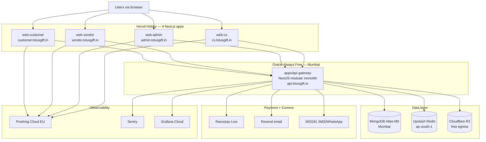

# Deployment

**Audience**: anyone shipping production infrastructure
**Phase**: P22 (Going to Production) — but provisioned incrementally from P5 onward
**Last reviewed**: 2026-05-18
**Owner**: @goldr0g3r

Step-by-step provisioning of every production piece. India-first per [`ADR-0005`](../adr/0005-hosting-oracle-mumbai-plus-vercel.md). Read [`overview.md`](./overview.md) first; the rest are reference docs for each subsystem.

## Reading order

1. [`overview.md`](./overview.md) — Production architecture diagram + why India-region.
2. [`oracle-vm-setup.md`](./oracle-vm-setup.md) — Oracle Always Free A1.Flex VM provisioning (4 OCPU, 24GB ARM, Mumbai).
3. [`mongodb-atlas-setup.md`](./mongodb-atlas-setup.md) — Atlas M0 cluster (Mumbai region) + collection namespacing + 3 search indexes.
4. [`upstash-redis-setup.md`](./upstash-redis-setup.md) — Redis for sessions, cache, idempotency, stock reservations.
5. [`cloudflare-r2-setup.md`](./cloudflare-r2-setup.md) — Object storage for images, art uploads, KYC docs.
6. [`vercel-setup.md`](./vercel-setup.md) — 4 Next.js apps on Vercel Hobby (subdomains).
7. [`razorpay-setup.md`](./razorpay-setup.md) — Live mode activation, webhook configuration.
8. [`resend-msg91-setup.md`](./resend-msg91-setup.md) — Email (Resend) + SMS/WhatsApp (MSG91).
9. [`posthog-setup.md`](./posthog-setup.md) — Analytics + feature flags (Cloud EU, 1M events/mo free).
10. [`sentry-setup.md`](./sentry-setup.md) — Error tracking + performance monitoring.
11. [`grafana-cloud-setup.md`](./grafana-cloud-setup.md) — Logs + metrics + traces via OTEL.
12. [`domain-ssl-setup.md`](./domain-ssl-setup.md) — Domain registration + Cloudflare DNS + SSL certificates.
13. [`github-secrets-setup.md`](./github-secrets-setup.md) — CI secrets configuration.
14. [`ci-cd-pipeline.md`](./ci-cd-pipeline.md) — GitHub Actions workflows + deploy pipeline.
15. [`soft-launch-checklist.md`](./soft-launch-checklist.md) — The P22 pre-launch checklist.

## Production architecture (one slide)

## Free-tier budget summary

Every service stays on free tier until revenue justifies upgrade. Tracked by [`../runbooks/free-tier-burn.md`](../runbooks/free-tier-burn.md).

| Service | Free tier limit | Upgrade trigger |
| ------- | --------------- | --------------- |
| Oracle A1.Flex | 4 OCPU + 24GB ARM | CPU >80% sustained |
| Atlas M0 | 1 cluster, 512MB storage, 3 search indexes | Storage >400MB or need 4th index |
| Upstash Redis | 10k cmds/day | >7k cmds/day (70%) |
| Vercel Hobby | 100GB bandwidth/mo | >70GB |
| PostHog Cloud | 1M events/mo | >700k events |
| Cloudflare R2 | 10GB storage, free egress | >7GB storage |
| Sentry | 5k errors/mo | >3.5k errors |
| Grafana Cloud | 50GB logs, 10k metrics | >35GB logs |

## See also

- [`../runbooks/oracle-deploy.md`](../runbooks/oracle-deploy.md) — operational deploy procedure
- [`../runbooks/going-to-production.md`](../runbooks/going-to-production.md) — P22 launch checklist
- [`../runbooks/scaling-up.md`](../runbooks/scaling-up.md) — what to do when free tiers are exceeded
- [`../adr/0005-hosting-oracle-mumbai-plus-vercel.md`](../adr/0005-hosting-oracle-mumbai-plus-vercel.md)
