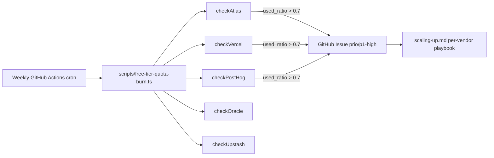

# Free-tier burn runbook

> Documents the weekly [`scripts/free-tier-quota-burn.ts`](../../scripts/free-tier-quota-burn.ts) cron + the per-vendor quota table + the 70 %-threshold response. The script + workflow are already shipped — this runbook documents them.

The script is invoked by [`.github/workflows/free-tier-burn.yml`](../../.github/workflows/free-tier-burn.yml) on a weekly cron. When any per-vendor metric crosses the threshold (default `0.70`), the script opens a GitHub issue tagged `phase/0 + area/infra + prio/p1-high` with the breach details and forward-pointers to `docs/runbooks/scaling-up.md`.

---

## 1. Overview

The script (`scripts/free-tier-quota-burn.ts`) checks five vendors per run:



A vendor with missing credentials emits a `skipped` result (logged at INFO) rather than failing the run. Missing creds = "the consuming code hasn't been written yet" — bootstrap-safe.

---

## 2. Per-vendor quota table (snapshot 2026-05-14)

The live numbers are in `scripts/free-tier-quota-burn.ts`. The table below mirrors them for at-a-glance reading. Refresh quarterly via the [`oracle-quarterly-review.md`](oracle-quarterly-review.md) cadence.

| Vendor | Tier | Metric | Quota | Source (retrieval-dated) | Code |
| --- | --- | --- | --- | --- | --- |
| MongoDB Atlas | M0 | Storage | 0.5 GB hard cap | <https://www.mongodb.com/docs/atlas/reference/free-shared-limitations/> | [line 138](../../scripts/free-tier-quota-burn.ts) |
| MongoDB Atlas | M0 | Atlas Search indexes | 3 indexes / cluster | <https://www.mongodb.com/docs/atlas/reference/free-shared-limitations/> | Q5 — not yet implemented |
| MongoDB Atlas | M0 | Doc count | 2 M docs / cluster | <https://www.mongodb.com/docs/atlas/reference/free-shared-limitations/> | Q5 — not yet implemented |
| Vercel | Hobby | Outbound bandwidth | 100 GB/month | <https://vercel.com/docs/limits/usage> | [line 214](../../scripts/free-tier-quota-burn.ts) |
| Vercel | Hobby | Build minutes | 6000/month | <https://vercel.com/docs/limits/usage> | not yet implemented |
| Vercel | Hobby | Function compute | 100 GB-hours/month | <https://vercel.com/docs/limits/usage> | not yet implemented |
| Upstash Redis | Free | Commands/month | 500K | <https://upstash.com/pricing/redis> | implementation deferred to P5 (line 326) |
| Upstash Redis | Free | Bandwidth | 10 GB/month | <https://upstash.com/pricing/redis> | implementation deferred to P5 |
| Upstash Redis | Free | Data size | 256 MB | <https://upstash.com/pricing/redis> | implementation deferred to P5 |
| Oracle Cloud | Always Free | A1.Flex OCPU + RAM | 3000 OCPU-hr + 18000 GB-RAM-hr / month per tenancy | <https://docs.oracle.com/en-us/iaas/Content/FreeTier/freetier.htm> | manual check (line 304) |
| Oracle Cloud | Always Free | Idle reclaim | < 20 % CPU + memory + network for 7 days | [`infrastructure/oracle/scripts/heartbeat.sh`](../../infrastructure/oracle/scripts/heartbeat.sh) mitigates | heartbeat handled out-of-band |
| PostHog Cloud EU | Free | Events ingested | 1 M / month | <https://posthog.com/pricing> | implementation deferred to P3b (line 280) |
| PostHog Cloud EU | Free | Session replays | 5K / month | <https://posthog.com/pricing> | implementation deferred to P3b |
| Cloudflare R2 | Free | Storage | 10 GB | <https://developers.cloudflare.com/r2/pricing/> | manual check (not yet implemented) |
| Cloudflare R2 | Free | Class A operations | 1 M / month | <https://developers.cloudflare.com/r2/pricing/> | manual check |
| GitHub Actions | Free (public repo) | Minutes | unlimited for public repos | <https://docs.github.com/en/billing/managing-billing-for-your-products/about-billing-for-github-actions> | not metered |
| Resend | Free | Emails | 3K / month, 100 / day | <https://resend.com/pricing> | implementation deferred to P12 |

Threshold = `0.70` by default (per `.cursor/rules/free-tier-budget.mdc`). Override with `QUOTA_BURN_THRESHOLD=0.85` in the workflow env if a specific vendor needs a different cadence — never above `0.85` without an ADR.

---

## 3. The script + the workflow

The script lives at [`scripts/free-tier-quota-burn.ts`](../../scripts/free-tier-quota-burn.ts). It is pure TypeScript executed via `tsx` (no compile step). Exit codes:

- `0` — completed (with or without quota breaches; with or without skipped checks).
- `1` — unexpected error (network failure, unparseable response, etc.).

The workflow lives at [`.github/workflows/free-tier-burn.yml`](../../.github/workflows/free-tier-burn.yml). Trigger: `schedule: cron: "0 0 * * 1"` (every Monday 00:00 UTC = ~05:30 IST). Manual trigger via `workflow_dispatch` is also enabled.

The workflow's only job:

1. `actions/checkout@v6` the repo.
2. `pnpm/action-setup@v6` + `actions/setup-node@v6` + `pnpm install --frozen-lockfile`.
3. `pnpm tsx scripts/free-tier-quota-burn.ts` (no `--dry-run` in CI; dry-run is for local validation).

Required GitHub Actions secrets (set under repo Settings → Secrets and variables → Actions):

| Secret | Used by | First needed at | Wired into workflow env? |
| --- | --- | --- | --- |
| `ATLAS_PUBLIC_KEY`, `ATLAS_PRIVATE_KEY`, `ATLAS_GROUP_ID` (optional: `ATLAS_CLUSTER_NAME`) | `checkAtlas` | P3 dev-stack populates these | Add at P3 when the script first becomes useful |
| `VERCEL_TOKEN` (optional: `VERCEL_TEAM_ID`) | `checkVercel` | P16 web-customer launch | Add at P16 |
| `POSTHOG_API_KEY`, `POSTHOG_PROJECT_ID` | `checkPostHog` | P3b analytics-sdk | Add at P3b |
| `UPSTASH_API_TOKEN`, `UPSTASH_EMAIL` | `checkUpstash` | P5 auth-service rate-limit | Add at P5 |
| `GH_TOKEN` (auto from `secrets.GITHUB_TOKEN`) | issue creation | always | Already passed |

Missing creds for any vendor → that vendor's check is skipped (logged at INFO) — the rest still run.

> **Important:** adding a repo secret alone is NOT enough. The workflow YAML at [`.github/workflows/free-tier-burn.yml`](../../.github/workflows/free-tier-burn.yml) currently passes only `GH_TOKEN`. When you bootstrap a new vendor's token (per the phase column above), update the workflow's `env:` block to inject the corresponding secret(s) into the script's process environment in the same PR. Without that wiring, the script keeps reading `undefined` and the check stays skipped.

---

## 4. Bootstrapping per-vendor tokens

### Atlas

1. Atlas Console → Organization → Access Manager → Create API Key.
2. Scopes: `Project Read Only` for the LotusGift project (minimum permission set — never grant `Project Owner`).
3. Access list: add only the published GitHub Actions runner IP ranges (per <https://api.github.com/meta>, refreshed quarterly via the oracle-quarterly-review.md cadence). **Do NOT** use `0.0.0.0/0` — a leaked read-only key still exposes cluster metadata + quota information; the access-list is the second factor.
4. Paste `Public Key`, `Private Key`, and `Project ID` as repo secrets.
5. Set a 90-day expiry on the key; rotate via the same Access Manager UI on the quarterly review.

### Vercel

1. Vercel → Account Settings → Tokens → Create.
2. Scope: read-only to all teams.
3. Paste as `VERCEL_TOKEN`; if you use a team, paste team ID as `VERCEL_TEAM_ID`.

### PostHog

1. PostHog → Project Settings → Project API Key (the "personal API key", not the project token).
2. Paste as `POSTHOG_API_KEY`; project ID as `POSTHOG_PROJECT_ID`.

### Upstash

1. Upstash Console → Account → Management API → Create.
2. Paste as `UPSTASH_API_TOKEN`; the account email as `UPSTASH_EMAIL`.

### Oracle Cloud + Cloudflare R2

Not yet implemented in the script (the Oracle SDK auth + R2 API token plumbing land at P21 + P22). Manual checks via the respective consoles in the meantime — see [`oracle-quarterly-review.md`](oracle-quarterly-review.md) for the Oracle billing check.

---

## 5. Threshold response procedure

When the script opens an issue:

1. **Acknowledge.** Assign yourself in the issue; comment `triaged at <ISO timestamp>`.
2. **Read the breach line in the script output** — vendor, metric, used, quota, ratio, note.
3. **Open [`docs/runbooks/scaling-up.md`](scaling-up.md)** and jump to the relevant section by vendor:
   - Atlas storage / index → [§3 Atlas M0 → M10](scaling-up.md#3-atlas-m0-m10-upgrade)
   - Vercel bandwidth / builds → [§ Vercel Hobby → Pro](scaling-up.md) (forward-pointer; full section lands at P16)
   - PostHog events → [§4 PostHog self-host](scaling-up.md#4-posthog-cloud-eu-self-hosted-india-dpdp-residency)
   - Upstash commands / data → [§7 Upstash → self-hosted Redis](scaling-up.md#7-upstash-redis-self-hosted-redis-on-the-oracle-vm)
4. **Decide:** temporary spike or chronic? If temporary, comment the cause + mitigation + close the issue. If chronic, file a follow-up ADR + upgrade-path PR per the scaling-up section.
5. **Update the script** if the quota table has changed (vendors revise free-tier limits ~once/year).

---

## 6. Local dry-run

Operators can simulate the script locally without opening an issue:

```bash
pnpm tsx scripts/free-tier-quota-burn.ts --dry-run
```

With `--dry-run`:

- Real API calls still happen (so you need the same credentials in your shell env as the workflow has in repo secrets).
- The summary issue body is printed to stdout instead of being POSTed to GitHub.
- Exit code is still `0` on success / `1` on error.

Useful before flipping a token, before changing the threshold, or after editing the script to add a new vendor.

---

## 7. Operational invariants

1. **Never raise `QUOTA_BURN_THRESHOLD` above `0.85`** without an ADR documenting the deferred response window.
2. **Never disable a vendor check** by deleting from `scripts/free-tier-quota-burn.ts` — comment with `// disabled <date> per ADR-XXX` instead.
3. **Every breach issue must be triaged within 24 hours.** Repeated breaches on the same axis → file an upgrade-path PR within 7 days.
4. **The script is the source of truth for live quotas.** This runbook table is a snapshot; if they diverge, the script wins. Refresh the table quarterly.
5. **Never push live credentials into the script itself** — always via env vars / repo secrets.

---

## Related runbooks

- [`docs/runbooks/scaling-up.md`](scaling-up.md) — the per-vendor upgrade playbook the issue links to.
- [`docs/runbooks/oracle-quarterly-review.md`](oracle-quarterly-review.md) — refresh the quota table here.
- [`docs/runbooks/going-to-production.md`](going-to-production.md) — pre-launch quota audit.
- Parent plan: [`.cursor/plans/lotusgift_v2_architecture_rebuild_512d4adf.plan.md`](../../.cursor/plans/lotusgift_v2_architecture_rebuild_512d4adf.plan.md) §9 "Hosting + free-tier strategy".
