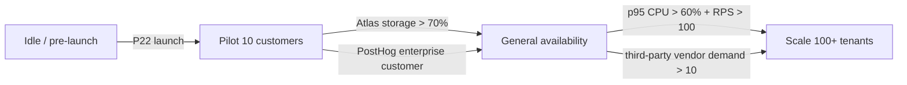

# Scaling-up runbook

> Trigger thresholds and migration paths for every Phase-0 vendor + architecture choice. Hold each section until its trigger fires — don't pre-emptively upgrade. Every section names the parent-plan todo id (e.g. P9c) for forward-traceability.

The default posture is **free-tier-first** per `.cursor/rules/free-tier-budget.mdc`. The weekly [`scripts/free-tier-quota-burn.ts`](../../scripts/free-tier-quota-burn.ts) cron opens a `prio/p1-high` issue when any axis crosses 70 %. The issue body cross-references this runbook for the per-vendor upgrade path.

---

## 1. Overview

We scale across 6 axes. Each has a trigger, a migration cost, a rollback path, and a forward owner. Triggers are **AND** conditions unless noted — a single brief spike does not justify the migration cost.

---

## 2. Microservice split (per-`services/*` module)

**Trigger:** sustained p95 CPU > 60 % AND sustained RPS > 100 for 7 days on a single service module within the modular monolith (`apps/api-gateway` at P4).

**Why we wait:** every service module in `services/*` is already isolated behind an `@Module` boundary + an `OutboxPort` event interface (per `.cursor/rules/microservice-boundaries.mdc`). Splitting it into a standalone process costs ~1 sprint of work (extract Dockerfile + GHCR pipeline + Atlas connection + dedicated env vars) and adds ~50 ms inter-service latency per call. Not worth it until the monolith genuinely throttles.

**Migration path:**

1. Profile the offending service module under load (`pnpm tsx scripts/profile-service.ts <service>` — to be written at P15).
2. Open an ADR under `docs/architecture/` justifying the split (which module, expected resource freed on the gateway, expected latency cost).
3. Extract the service module to its own `apps/<service>/` app following the `apps/api-gateway/` shape from P4.
4. New Dockerfile + new entry in `.github/workflows/deploy-oracle.yml` (or a new VM at this point — single-VM ceiling = 4 OCPU + 24 GB).
5. Replace the in-process `OutboxPort` call with an HTTP / RabbitMQ / NATS-based transport (transport choice = a separate ADR per `.cursor/rules/event-driven-discipline.mdc`).
6. Cut over via the gateway's feature flag (PostHog).

**Likely first candidates:** `services/payment-service` (P10 — Razorpay webhook traffic), `services/insights-service` (P15 — ML workloads), `services/notification-service` (P12 — fan-out fan-out).

---

## 3. Atlas M0 → M10 upgrade

**Trigger:** Atlas storage > 70 % per [`scripts/free-tier-quota-burn.ts:138`](../../scripts/free-tier-quota-burn.ts) **OR** Atlas Search index demand > 3 (M0 hard-caps at 3 search indexes per cluster, per [Atlas free-shared-limitations](https://www.mongodb.com/docs/atlas/reference/free-shared-limitations/)) **OR** total doc count crossing 1.5 M (M0 hard-cap = 2 M; we leave a 25 % safety margin).

**Cost:** M10 on AWS Mumbai is `$0.08/hr` (~`$57/month`). M10 unlocks: continuous backup, 10 GB storage, BI Connector, dedicated CPU, IP whitelisting fine-grained per cluster.

**Migration path:**

1. Add a doc-count + index-count check to `scripts/free-tier-quota-burn.ts` (Q5 in the [research note](../research/phase-0-future-docs.md#3-open-questions)). Until then, manually check via the Atlas console.
2. Trigger a `mongodump` per [`backup-restore.md` §3](backup-restore.md#3-atlas-m0-backup) of the M0 cluster.
3. In the Atlas console: Cluster → Edit → Tier → M10 → Confirm. Atlas runs an in-place upgrade with ~5 min of read-only latency (no full downtime).
4. Re-run the dump after the upgrade to validate data integrity.
5. Enable continuous backup (M10 default; verify).
6. Retire the `mongodump` cron once continuous backup is verified for 7 days.
7. Update `docs/runbooks/backup-restore.md` to reflect the new RPO (was 24h with mongodump → < 5 min with continuous backup).

**Rollback:** Atlas M10 → M0 downgrade is supported but loses continuous backup history. Restore from the pre-upgrade dump if needed.

---

## 4. PostHog Cloud EU → self-hosted (India DPDP residency)

**Trigger:** first enterprise customer requires India-only data residency under the Digital Personal Data Protection Act, 2023 (DPDP). Until then, PostHog Cloud EU is compliant for general use (per [PostHog GDPR docs](https://posthog.com/docs/integrate/gdpr)).

**Cost:** self-host on Oracle Mumbai. Reference architecture = Kubernetes; PostHog provides a Helm chart (per [PostHog self-host docs](https://posthog.com/docs/self-host)). Estimated ops cost = 1 OCPU + 2 GB RAM on the existing A1.Flex (already within Always Free budget) but adds ~1 day / month of ops time.

**Migration path:**

1. Open an ADR identifying the customer requirement + the residency exception driving the move.
2. Stand up a small Oracle VM in Mumbai (separate from the api-gateway VM to isolate failure domains).
3. Deploy PostHog via the official Helm chart with PostgreSQL + ClickHouse + Redis as managed deps.
4. Export historical events from Cloud EU via the Personal Export API.
5. Re-point `POSTHOG_HOST` in all `.env.production` files to the new self-host URL.
6. Validate event ingestion + dashboard parity over 7 days.
7. Cancel the Cloud EU billing.

**Watch this regardless of the trigger:** DPDP enforcement rules from MeitY are still evolving (initial Rules notification Oct 2024; enforcement timeline TBD). Pre-emptive ADR at P21 per Q1 in the [research note](../research/phase-0-future-docs.md#3-open-questions).

---

## 5. Mobile apps (RN vs native)

**Trigger:** the recipient portal (P19 web-customer-service) hits > 30 % traffic from mobile + > 100 unique-customer/day complaints about "needs an app". Until then, the PWA + WhatsApp delivery confirmations cover the recipient flow.

**Choice matrix:**

| Need | Pick |
| --- | --- |
| Time-to-market < 4 weeks; small surface area (recipient confirm + tracking) | React Native + Expo (~80 % code share with `web-customer-service`) |
| Brand-grade animations + offline-first + deep camera/AR (e.g. AR mockup previews for customization) | Native Swift + Kotlin |

**Cost:** RN = 1-2 dev-months. Native = 4-6 dev-months for parity. Apple Developer Program = `$99/year`. Google Play = `$25` one-time.

**Forward owner:** TBD at P22 launch retrospective.

---

## 6. Marketplace-operated FBA-style warehouses

**Trigger:** third-party vendor demand for "store + ship from your warehouse" > 10 vendors AND average vendor's per-month inventory turnover < their own per-warehouse SLA. Until then, vendors run their own warehouses (P6 multi-warehouse registry suffices).

**What changes:**

- `services/vendor-service` (P6) gets a new `ownerType: vendor | platform` flag (already forward-compat per the parent plan §5).
- `services/inventory-service` (P8) gets cross-warehouse-transfer events (already in the P8 todo).
- New `services/fulfillment-service` (NEW for this scaling step) for the platform-side pick + pack + ship workflow.
- Revenue model = monthly storage fee per cubic meter + per-shipment pick fee.

**Cost:** physical lease + WMS software + staff. Out of scope for free-tier conversation; opens a Phase-23+ ADR.

---

## 7. Upstash Redis → self-hosted Redis on the Oracle VM

**Trigger:** Upstash commands/day > 70 % of the 500K/month free cap **OR** monthly bandwidth > 70 % of 10 GB **OR** data > 200 MB (free cap = 256 MB) (per [Upstash pricing, 2026-05-14](https://upstash.com/pricing/redis)).

**Cost:** self-hosted Redis on the Oracle A1.Flex VM uses ~256 MB RAM + ~0.5 OCPU — comfortably within budget. Adds ~1 hour of setup + becomes a SPOF (single point of failure: VM down = no Redis).

**Migration path:**

1. Provision Redis on the Oracle VM (same apt repo as [`docs/runbooks/local-development.md`](local-development.md#ubuntu-2404-lts-noble)).
2. Add a systemd unit + UFW rule + fail2ban jail mirroring the `lotusgift-api.service` pattern.
3. Configure RDB persistence to `/var/lib/redis/dump.rdb` with daily snapshot upload to R2 (mirrors the Atlas mongodump pattern).
4. Test connectivity from the api-gateway via `redis-cli -h 127.0.0.1 -p 6379 ping`.
5. Use `redis-cli --rdb` to dump from Upstash, transfer via R2, restore on the VM.
6. Re-point `REDIS_URL` to `redis://127.0.0.1:6379`.
7. Drain Upstash for 24h; cancel the account.

**Forward consideration:** if Redis on the VM also hits its ceiling, the next step is Redis Cluster on a dedicated VM (still within Oracle Always Free 4-OCPU budget across 2 VMs).

---

## 8. Operational invariants

1. **Never upgrade without a trigger.** Every scaling step has a measurable trigger; pre-emptive upgrades burn budget without a delivered benefit.
2. **Every upgrade ships behind a PostHog feature flag.** Allows instant rollback if the new tier surfaces a new failure mode.
3. **Every upgrade gets a research note.** Mirrors the Phase-0 pattern: `docs/research/scale-<axis>-<date>.md` with retrieval-dated citations for the chosen tier's quotas.
4. **Free-tier threshold = 70 %.** Never raise above 85 % without an ADR.
5. **First responder = on-call.** Scaling decisions made in the heat of an incident go through `incident-response.md` review post-incident.

---

## Related runbooks

- [`docs/runbooks/free-tier-burn.md`](free-tier-burn.md) — the weekly cron that fires the trigger issue.
- [`docs/runbooks/going-to-production.md`](going-to-production.md) — what happens before the first scaling step.
- [`docs/runbooks/incident-response.md`](incident-response.md) — what to do if a scaling step backfires.
- [`docs/runbooks/backup-restore.md`](backup-restore.md) — every scaling step starts with a backup.
- Parent plan: [`.cursor/plans/lotusgift_v2_architecture_rebuild_512d4adf.plan.md`](../../.cursor/plans/lotusgift_v2_architecture_rebuild_512d4adf.plan.md) — references P4 / P6 / P8 / P9c / P10 / P12 / P15 / P19 / P22.
