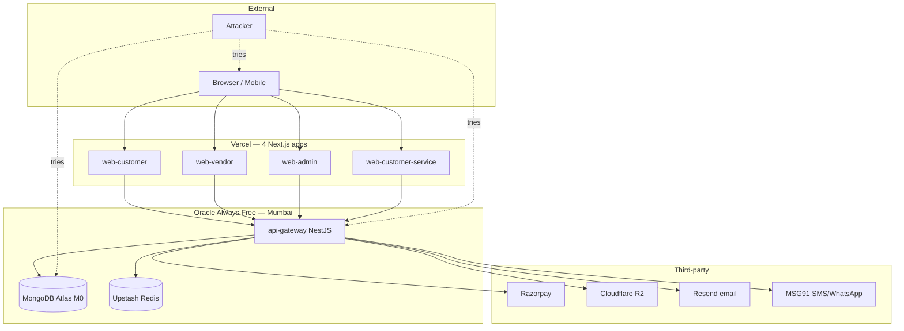

# Threat model

**Audience**: @goldr0g3r + future security reviewers
**Phase**: P5 (first draft) → P22 (production-ready)
**Last reviewed**: 2026-05-18
**Owner**: @goldr0g3r
**Review cadence**: Monthly + post-incident

STRIDE-style threat model. Living document — updated whenever a new data flow lands.

## Assets in scope

1. **Personal data** — buyer names, addresses, phone numbers, email addresses.
2. **Vendor business data** — PAN, GSTIN, bank account details (KYC documents).
3. **Payment tokens** — Razorpay order IDs, payment IDs (never raw PAN/CVV).
4. **Authentication credentials** — Better-Auth sessions, passkey public keys, TOTP secrets.
5. **Recipient lists** — CSV data with N recipients' names, addresses, phone numbers.
6. **Product/pricing data** — vendor-confidential wholesale pricing, MOQ terms.

## Trust boundaries

## STRIDE analysis

### Spoofing

| Threat | Mitigation |
| ------ | ---------- |
| Attacker impersonates buyer | Better-Auth session + passkey/2FA; httpOnly cookies |
| Attacker impersonates vendor | KYC verification gate; Organization-scoped roles |
| Forged Razorpay webhook | HMAC-SHA256 signature verification on raw body |

### Tampering

| Threat | Mitigation |
| ------ | ---------- |
| Modified order totals | Server-side price calculation from DB; client total is display-only |
| Tampered recipient-list CSV | Server-side re-validation after upload; row-level Zod parsing |
| Modified stock quantities | Atomic MongoDB operations; no client-side stock writes |

### Repudiation

| Threat | Mitigation |
| ------ | ---------- |
| Buyer denies placing order | Order event audit trail (`order.placed.v1`) with timestamp + user ID |
| Vendor denies quote acceptance | RFQ state machine with timestamped transitions |

### Information Disclosure

| Threat | Mitigation |
| ------ | ---------- |
| KYC documents exposed | Encrypted at rest in R2; presigned URLs with short TTL; vendor+admin access only |
| Recipient PII in logs | PII fields stripped from log output; PostHog/Sentry data redaction rules |
| Cross-vendor data leak | All queries scoped by vendorId; no aggregate vendor queries from vendor portal |

### Denial of Service

| Threat | Mitigation |
| ------ | ---------- |
| Auth endpoint brute-force | Rate limiting per IP (10 req/min on login/OTP) |
| Cart reservation flooding | Per-user cart limit (50 items); Redis TTL auto-cleanup |
| Large CSV upload bomb | File size limit (10MB); row count limit (10,000 recipients) |

### Elevation of Privilege

| Threat | Mitigation |
| ------ | ---------- |
| Buyer accessing admin endpoints | Role-based guards (`@Roles('admin')`) on admin controllers |
| Vendor accessing other vendor's data | vendorId extracted from session, not request params |
| Horizontal privilege escalation | Organization-scoped resources; ID ownership verified server-side |

## Open items

- [ ] Implement rate limiting (Phase 9+)
- [ ] Add request signing for internal service calls (if split-mode activated)
- [ ] Penetration test before production launch (P22)
- [ ] OWASP ASVS Level 2 self-assessment (P22)
