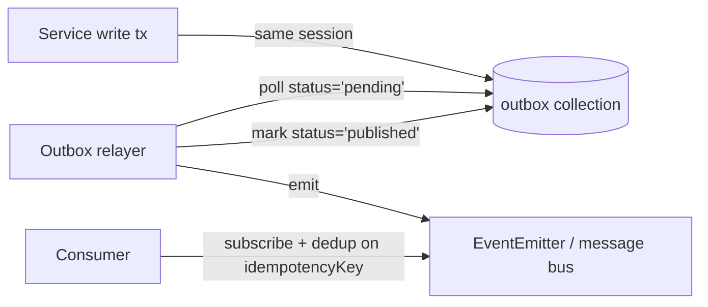

# `@repo/events`

LotusGift v2's L1 transport-agnostic event-schema package. Holds the `BaseEventEnvelope`, `__schemaVersion` helpers, `OutboxRow` schema, `defineEvent` builder, and reserves per-service subpaths for the events that land in P5+ service phases.

Per [`.cursor/rules/event-driven-discipline.mdc`](../../.cursor/rules/event-driven-discipline.mdc), every event is published via `OutboxPort.publish(event, { transactionId })` inside the same Mongo transaction as the domain write that produced it. Never call `EventEmitter.emit()` directly from service code.

## Module map

| Module | Exports | Use when |
| --- | --- | --- |
| [`envelope.ts`](src/envelope.ts) | `BaseEventEnvelopeSchema`, `BaseEventEnvelope` type | Foundation for every event schema; consumed by `defineEvent`. |
| [`version.ts`](src/version.ts) | `parseSchemaVersion`, `formatSchemaVersion`, `isCompatibleVersion`, `bumpMinor`, `bumpMajor` | Validating + bumping `__schemaVersion` strings. |
| [`outbox.ts`](src/outbox.ts) | `OutboxRowSchema`, `OutboxRow` type | The Mongo `outbox` collection row shape. Consumed by `@repo/utils/OutboxPort` (P3) + the relayer (P4). |
| [`builders.ts`](src/builders.ts) | `defineEvent(name, payloadSchema)`, `DefinedEvent` type | Declaring a new domain event. |
| `<service>/index.ts` (16 folders) | Empty — populated in P5+ per-service phases. | Subpath import: `import { OrderPlacedV1 } from '@repo/events/order'`. |

## `defineEvent` recipe

```ts
// packages/events/src/order/placed.v1.ts (lands at P9)
import { defineEvent } from '@repo/events';
import { z, InrPaiseSchema, UlidSchema } from '@repo/validators';

export const OrderPlacedV1 = defineEvent(
  'order.placed.v1',
  z.object({
    orderId: UlidSchema,
    totalPaise: InrPaiseSchema,
    routedTo: z.enum(['cart', 'rfq']),
  }),
);
export type OrderPlacedV1Payload = z.infer<typeof OrderPlacedV1.schema>;
```

```ts
// services/order-service/src/order.service.ts (lands at P9)
import { ulid } from 'ulidx';
import { OrderPlacedV1 } from '@repo/events/order';

await this.db.session.withTransaction(async (session) => {
  const order = await this.orders.create([{ ... }], { session });
  await this.outbox.publish(
    OrderPlacedV1.schema.parse({
      __schemaVersion: '1.0',
      idempotencyKey: `order:${order.id}:placed:1`,
      eventId: ulid(),
      occurredAt: new Date().toISOString(),
      type: OrderPlacedV1.name,
      payload: { orderId: order.id, totalPaise: total, routedTo: 'cart' },
    }),
    { session },
  );
});
```

## `__schemaVersion` evolution policy

`MAJOR.MINOR` strings (not full semver) — patch changes add noise for wire formats.

- **MINOR bump (additive)**: new optional field on the payload. Consumers pinned to the older version still parse + ignore the new field. Old + new producers can coexist indefinitely.
- **MAJOR bump (breaking)**: removed/renamed/typed-differently field. Ship `v2` alongside `v1` (new file: `<event-name>.v2.ts`). Producers can publish either; consumers migrate at their own pace. Retire `v1` only after the last consumer has migrated.

Versioning is per-event, not per-package — `OrderPlacedV1` and `OrderCancelledV1` evolve independently.

## OutboxRow + the publish pipeline



The relayer + `OutboxPort` implementation live in [`@repo/utils`](../utils/) (lands at P3). This package owns the schema contract only.

## L1 placement

Per [`.cursor/rules/architecture-layers.mdc`](../../.cursor/rules/architecture-layers.mdc), L1 packages import from L0 only. This package imports `zod` (L0 npm) + `@repo/validators` + `@repo/types` (both L1 siblings). It does NOT import NestJS, Mongoose, or any transport library — the schemas must be runnable in a worker, a Lambda, or a browser test.

## Adding a per-service event (P5+)

1. Drop the file at `src/<service>/<event-name>.v1.ts` — e.g. `src/payment/captured.v1.ts`.
2. `import { defineEvent } from '../builders.js'` + `import { z, ... } from '@repo/validators'`.
3. Re-export from `src/<service>/index.ts`.
4. Consumer imports via subpath: `import { PaymentCapturedV1 } from '@repo/events/payment'`.
5. Add a unit test next to the file covering the event's full payload round-trip.
6. Document the event + payload in the consuming services' READMEs.
